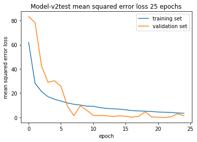

# deeps

_Attempt at for solving Comma.ai's speed challenge_

This approach uses optical flow analysis and Convolutional neural networks to estimate the speed of a car using a dashcam footage of the car. We are provided with a training video (train.mp4) and the speed data at each frame  (train.txt).

- **train.mp4:** 20 fps video with 20400 frames, each frame is 640(w) x 840(h) x 3 (RGB)
- **train.txt:** Text file with speed data at each frame
- **test.mp4:** 20 fps video with 20400 frames, each frame is 640(w) x 840(h) x 3 (RGB)

### Training parameters
**Optimizer:** Adam

**loss:** MSE

**epoch:** 25

**Samples per epoch:** 400

**Batches per sample** 32 images, 16 optical flow rgb_diffs

I trained the model several times, all with difference MSE values.
When I trained the model by passing in simple RGB image differences as my discernible metric I received rather poor results. My Mean Square Error was ~20. When I used dense optical flow as the discernible metric my loss looks like this:
On 25 epochs, the final MSE was 3.4.

Remember, after we train the model I want to use the weights to perform linear regression: where I will simply take my weight matrix and multiply it with the input to predict the speed. This is not a classification task.

## Results

I got a MSE of 3.48 on training data and a MSE of 1.4 on validation data. Even though the validation curve has some noise, the overall trend suggests that we are not overfitting the training set. 

This was a iterative process like all Deep Learning projects are. This is a list of things I tuned / experimented with:
- **Inputs:** _check preprocessing section of this notebook to see the different inputs I used_
- **Hyperparameters:** epoch, batch_size, steps_per_epoch
- **Optimizers:** Batch Gradient Descent, RMS Prop, Momentum, Adam Optimizer

This gif is speed up 3X. Checkout the [full video here](https://youtu.be/LUTn_I52SMQ)

## What I learned from this project

1. Optical flow is a powerful tool to measure motion of objects in images.
2. Adam Optimizer converges faster because it uses momentum and RMS prop to modify the gradient during descent
3. Python generators can be used to yield batches of data. They are very efficient for image processing because most machines do not have enough memory to hold all the images when batching.
4. Video and image processing using OpenCV
5. Training on local machine is horrible for training algorithms. Always use cloud services. This also helps you train multiple models in parallel. (Mo money you spend, mo problems you solve)
